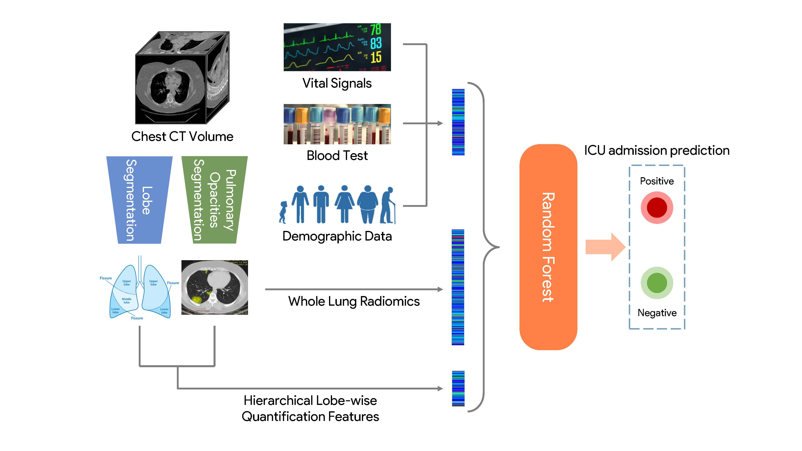

# Integrative Analysis for COVID-19 Patient Outcome Prediction
The code for paper [**Integrative Analysis for COVID-19 Patient Outcome Prediction**](https://www.ncbi.nlm.nih.gov/pmc/articles/PMC7386508)


## Citation
```
@article{chao2020integrative,
  title={Integrative Analysis for COVID-19 Patient Outcome Prediction},
  author={Chao, Hanqing and Fang, Xi and Zhang, Jiajin and Homayounieh, Fatemeh and Arru, Chiara D and Digumarthy, Subba R and Babaei, Rosa and Mobin, Hadi K and Mohseni, Iman and Saba, Luca and others},
  journal={arXiv preprint arXiv:2007.10416},
  year={2020}
}
```
